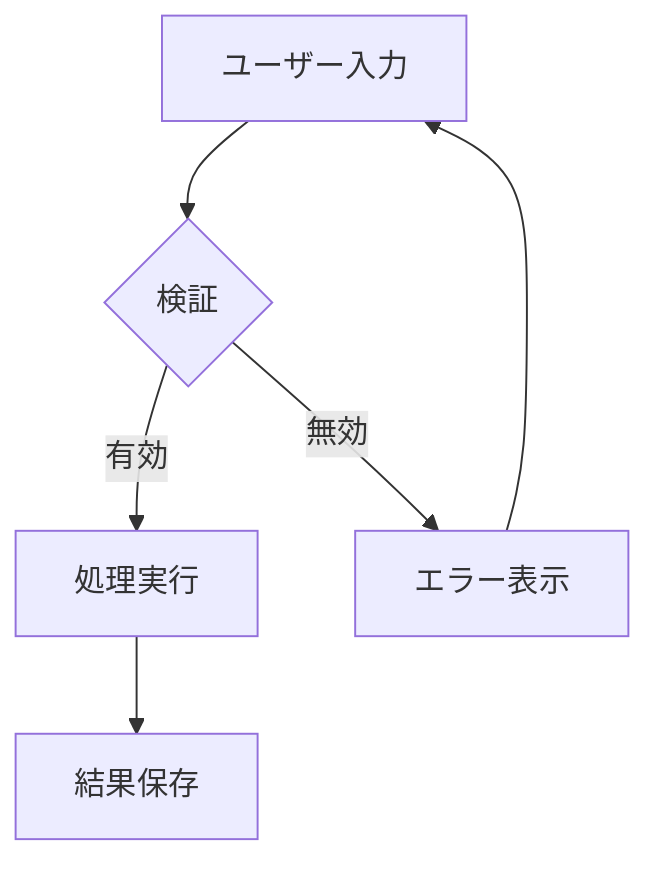
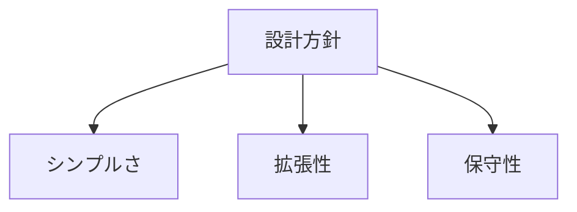

# JSON Canvas 使用例

## 1. シンプルなマインドマップ生成

### 入力リクエスト
「プロジェクト管理についてマインドマップをキャンバスで作成して」

### 出力例

```json
{
  "nodes": [
    {
      "id": "center",
      "type": "text",
      "x": 0,
      "y": 0,
      "width": 200,
      "height": 80,
      "text": "# プロジェクト管理",
      "color": "5"
    },
    {
      "id": "branch1",
      "type": "text",
      "x": -400,
      "y": -150,
      "width": 180,
      "height": 60,
      "text": "## 計画"
    },
    {
      "id": "branch2",
      "type": "text",
      "x": -400,
      "y": 0,
      "width": 180,
      "height": 60,
      "text": "## 実行"
    },
    {
      "id": "branch3",
      "type": "text",
      "x": -400,
      "y": 150,
      "width": 180,
      "height": 60,
      "text": "## 監視"
    },
    {
      "id": "branch4",
      "type": "text",
      "x": 400,
      "y": -75,
      "width": 180,
      "height": 60,
      "text": "## リソース"
    },
    {
      "id": "branch5",
      "type": "text",
      "x": 400,
      "y": 75,
      "width": 180,
      "height": 60,
      "text": "## リスク"
    }
  ],
  "edges": [
    {"id": "e1", "fromNode": "center", "fromSide": "left", "toNode": "branch1", "toSide": "right"},
    {"id": "e2", "fromNode": "center", "fromSide": "left", "toNode": "branch2", "toSide": "right"},
    {"id": "e3", "fromNode": "center", "fromSide": "left", "toNode": "branch3", "toSide": "right"},
    {"id": "e4", "fromNode": "center", "fromSide": "right", "toNode": "branch4", "toSide": "left"},
    {"id": "e5", "fromNode": "center", "fromSide": "right", "toNode": "branch5", "toSide": "left"}
  ]
}
```

---

## 2. Markdown見出し構造からキャンバス変換

### 入力Markdown

```markdown
# APIドキュメント

## 認証
### OAuth2.0
### APIキー

## エンドポイント
### GET /users
### POST /users
### DELETE /users/{id}

## エラーハンドリング
### 400 Bad Request
### 401 Unauthorized
### 500 Internal Server Error
```

### 変換ルール

1. `#` → 中央の大きなノード（色: シアン）
2. `##` → 第1階層ブランチ（色: 緑）
3. `###` → 第2階層ブランチ（色なし）
4. 親子関係をエッジで接続

### 出力キャンバス

```json
{
  "nodes": [
    {"id": "h1_0", "type": "text", "x": 0, "y": 0, "width": 250, "height": 80, "text": "# APIドキュメント", "color": "5"},
    {"id": "h2_1", "type": "text", "x": -400, "y": -200, "width": 200, "height": 60, "text": "## 認証", "color": "4"},
    {"id": "h3_1_1", "type": "text", "x": -700, "y": -250, "width": 180, "height": 50, "text": "### OAuth2.0"},
    {"id": "h3_1_2", "type": "text", "x": -700, "y": -180, "width": 180, "height": 50, "text": "### APIキー"},
    {"id": "h2_2", "type": "text", "x": -400, "y": 0, "width": 200, "height": 60, "text": "## エンドポイント", "color": "4"},
    {"id": "h3_2_1", "type": "text", "x": -700, "y": -70, "width": 180, "height": 50, "text": "### GET /users"},
    {"id": "h3_2_2", "type": "text", "x": -700, "y": 0, "width": 180, "height": 50, "text": "### POST /users"},
    {"id": "h3_2_3", "type": "text", "x": -700, "y": 70, "width": 180, "height": 50, "text": "### DELETE /users/{id}"},
    {"id": "h2_3", "type": "text", "x": -400, "y": 200, "width": 200, "height": 60, "text": "## エラーハンドリング", "color": "4"},
    {"id": "h3_3_1", "type": "text", "x": -700, "y": 130, "width": 180, "height": 50, "text": "### 400 Bad Request"},
    {"id": "h3_3_2", "type": "text", "x": -700, "y": 200, "width": 180, "height": 50, "text": "### 401 Unauthorized"},
    {"id": "h3_3_3", "type": "text", "x": -700, "y": 270, "width": 180, "height": 50, "text": "### 500 Internal Server Error"}
  ],
  "edges": [
    {"id": "e1", "fromNode": "h1_0", "fromSide": "left", "toNode": "h2_1", "toSide": "right"},
    {"id": "e2", "fromNode": "h2_1", "fromSide": "left", "toNode": "h3_1_1", "toSide": "right"},
    {"id": "e3", "fromNode": "h2_1", "fromSide": "left", "toNode": "h3_1_2", "toSide": "right"},
    {"id": "e4", "fromNode": "h1_0", "fromSide": "left", "toNode": "h2_2", "toSide": "right"},
    {"id": "e5", "fromNode": "h2_2", "fromSide": "left", "toNode": "h3_2_1", "toSide": "right"},
    {"id": "e6", "fromNode": "h2_2", "fromSide": "left", "toNode": "h3_2_2", "toSide": "right"},
    {"id": "e7", "fromNode": "h2_2", "fromSide": "left", "toNode": "h3_2_3", "toSide": "right"},
    {"id": "e8", "fromNode": "h1_0", "fromSide": "left", "toNode": "h2_3", "toSide": "right"},
    {"id": "e9", "fromNode": "h2_3", "fromSide": "left", "toNode": "h3_3_1", "toSide": "right"},
    {"id": "e10", "fromNode": "h2_3", "fromSide": "left", "toNode": "h3_3_2", "toSide": "right"},
    {"id": "e11", "fromNode": "h2_3", "fromSide": "left", "toNode": "h3_3_3", "toSide": "right"}
  ]
}
```

---

## 3. Mermaidフローチャートからの変換

### 入力Mermaid



### 変換出力

```json
{
  "nodes": [
    {"id": "A", "type": "text", "x": 0, "y": 0, "width": 200, "height": 60, "text": "ユーザー入力"},
    {"id": "B", "type": "text", "x": 0, "y": 150, "width": 200, "height": 60, "text": "検証", "color": "3"},
    {"id": "C", "type": "text", "x": -200, "y": 300, "width": 200, "height": 60, "text": "処理実行", "color": "4"},
    {"id": "D", "type": "text", "x": 200, "y": 300, "width": 200, "height": 60, "text": "エラー表示", "color": "1"},
    {"id": "E", "type": "text", "x": -200, "y": 450, "width": 200, "height": 60, "text": "結果保存", "color": "4"}
  ],
  "edges": [
    {"id": "e1", "fromNode": "A", "fromSide": "bottom", "toNode": "B", "toSide": "top"},
    {"id": "e2", "fromNode": "B", "fromSide": "bottom", "toNode": "C", "toSide": "top", "label": "有効"},
    {"id": "e3", "fromNode": "B", "fromSide": "bottom", "toNode": "D", "toSide": "top", "label": "無効"},
    {"id": "e4", "fromNode": "C", "fromSide": "bottom", "toNode": "E", "toSide": "top"},
    {"id": "e5", "fromNode": "D", "fromSide": "top", "toNode": "A", "toSide": "right"}
  ]
}
```

---

## 4. キャンバスからMarkdownへの変換

### 入力キャンバス

```json
{
  "nodes": [
    {"id": "n1", "type": "text", "x": 0, "y": 0, "width": 200, "height": 80, "text": "# 設計方針"},
    {"id": "n2", "type": "text", "x": -300, "y": 100, "width": 200, "height": 60, "text": "## シンプルさ"},
    {"id": "n3", "type": "text", "x": 0, "y": 100, "width": 200, "height": 60, "text": "## 拡張性"},
    {"id": "n4", "type": "text", "x": 300, "y": 100, "width": 200, "height": 60, "text": "## 保守性"}
  ],
  "edges": [
    {"id": "e1", "fromNode": "n1", "toNode": "n2"},
    {"id": "e2", "fromNode": "n1", "toNode": "n3"},
    {"id": "e3", "fromNode": "n1", "toNode": "n4"}
  ]
}
```

### 出力Markdown

```markdown
# 設計方針

## シンプルさ

## 拡張性

## 保守性
```

---

## 5. キャンバスからMermaidへの変換

### 入力キャンバス

（上記と同じキャンバス）

### 出力Mermaid



---

## 6. グループを使った構造化

### ユースケース
「フロントエンド・バックエンド・インフラの3層アーキテクチャをキャンバスで表現」

### 出力

```json
{
  "nodes": [
    {
      "id": "g1",
      "type": "group",
      "x": -350,
      "y": -100,
      "width": 300,
      "height": 400,
      "label": "フロントエンド",
      "color": "5"
    },
    {
      "id": "g2",
      "type": "group",
      "x": 0,
      "y": -100,
      "width": 300,
      "height": 400,
      "label": "バックエンド",
      "color": "4"
    },
    {
      "id": "g3",
      "type": "group",
      "x": 350,
      "y": -100,
      "width": 300,
      "height": 400,
      "label": "インフラ",
      "color": "6"
    },
    {"id": "fe1", "type": "text", "x": -320, "y": -50, "width": 240, "height": 50, "text": "React"},
    {"id": "fe2", "type": "text", "x": -320, "y": 20, "width": 240, "height": 50, "text": "Next.js"},
    {"id": "fe3", "type": "text", "x": -320, "y": 90, "width": 240, "height": 50, "text": "TailwindCSS"},
    {"id": "be1", "type": "text", "x": 30, "y": -50, "width": 240, "height": 50, "text": "Kotlin"},
    {"id": "be2", "type": "text", "x": 30, "y": 20, "width": 240, "height": 50, "text": "Spring Boot"},
    {"id": "be3", "type": "text", "x": 30, "y": 90, "width": 240, "height": 50, "text": "PostgreSQL"},
    {"id": "in1", "type": "text", "x": 380, "y": -50, "width": 240, "height": 50, "text": "GCP"},
    {"id": "in2", "type": "text", "x": 380, "y": 20, "width": 240, "height": 50, "text": "Cloud Run"},
    {"id": "in3", "type": "text", "x": 380, "y": 90, "width": 240, "height": 50, "text": "Cloud SQL"}
  ],
  "edges": [
    {"id": "e1", "fromNode": "fe2", "fromSide": "right", "toNode": "be2", "toSide": "left", "label": "API"},
    {"id": "e2", "fromNode": "be2", "fromSide": "right", "toNode": "in2", "toSide": "left", "label": "Deploy"},
    {"id": "e3", "fromNode": "be3", "fromSide": "right", "toNode": "in3", "toSide": "left", "label": "Hosted"}
  ]
}
```
